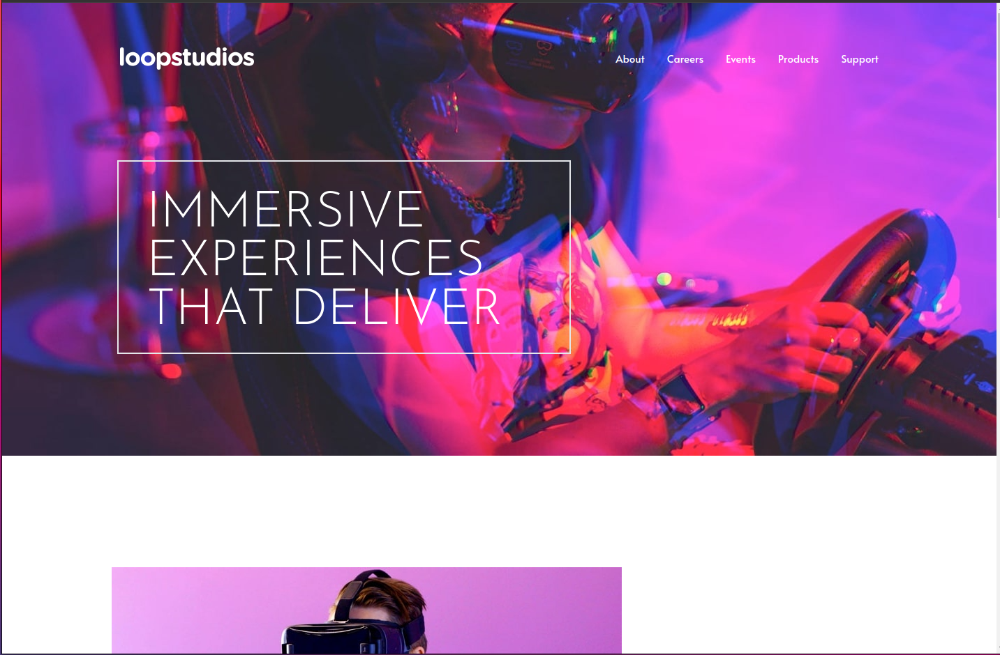

  <h2 align="center">Loop Studio Landing Page</h2>
  

    <a href="https://www.frontendmentor.io/challenges/loopstudios-landing-page-N88J5Onjw"><strong>Frontend Mentor Challenge</strong></a>
     
     
    <a href="https://ortonb110.github.io/loopstudio/">View Demo</a>
    ·
    <a href="https://github.com/ortonb110/loopstudio/issues" target="_blank">Report Bug</a>
    ·
    <a href="https://github.com/ortonb110/loopstudio/issues" target="_blank">Request Feature</a>
  

<!-- Bagdes -->

  <!-- Profile -->
  
  <!-- Status -->
    

#

This is a solution to the [Loop Studio Landing Page on Frontend Mentor](https://www.frontendmentor.io/challenges/loopstudios-landing-page-N88J5Onjw). Frontend Mentor challenges help you improve your coding skills by building realistic projects.

<h2 align="center">Links</h2>

- Solution URL: [Loop Studio Landing Page(React + Tailwind) | Frontend Mentor](https://www.frontendmentor.io/solutions/loopstudios-landing-page-cRKyFhhvQ9)
- Live Site URL: [https://ortonb110.github.io/loopstudio/](https://ortonb110.github.io/loopstudio/)

 

## Table of contents

- [Overview](#overview)
  - [The challenge](#the-challenge)
- [My process](#my-process)
  - [Built with](#built-with)
- [Author](#author)
- [Acknowledgments](#acknowledgments)

## Overview

### The challenge

Your users should be able to:

- View the optimal layout for the interface depending on their device's screen size
  The perfect project if you're learning how to interact with 3rd-party APIs. This challenge uses the Advice Slip API to generate random quotes of advice.

## My process

### Built with

<!-- Bagdes -->

- React
- React Hooks (useState, useEffect)
- Tailwind CSS
- Semantic HTML5 markup
- API
- Grid Layout

### Useful resources

- [React documentation](https://reactjs.org/)
- [Forwarding Refs in React](https://reactjs.org/docs/forwarding-refs.html)
- [Tailwind CSS](https://tailwindcss.com/)

## Author

- Frontend Mentor - [@ortonbright](https://www.frontendmentor.io/profile/ortonb110)

## Acknowledgments

This project uses [npm](https://www.npmjs.com/).

## Learn More

You can learn more in the [Create React App documentation](https://facebook.github.io/create-react-app/docs/getting-started).

To learn React, check out the [React documentation](https://reactjs.org/).
